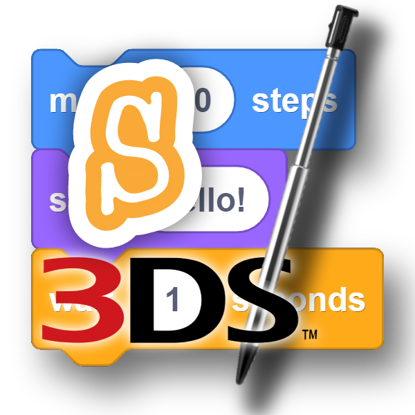

<h1 align="center"></img> Scratch for 3DS</h1>

## Introduction
Scratch for 3DS is a project started and created by [Ponali](https://github.com/Ponali) and [Wahlolly](https://github.com/TheWahlolly), based around the children's programming language, [Scratch](https://scratch.mit.edu/), and recreates it to be used on any kind of Nintendo 3DS system.
This project is currently in work-in-progress however, so bugs may occur.

## How is this made?
The code is made entirely in the C programming language, using famous 3DS utility libraries such as [libctru](https://libctru.devkitpro.org/) and [citro2d](https://citro2d.devkitpro.org/), and compiled using [DevkitPro](https://devkitpro.org/).

## How do i get a binary file for Scratch for 3DS?
Our reccomended approach is to download the binary file from the [latest release](https://github.com/Ponali/scratch-3ds/releases) so you don't have to get the hassle for installing any compiling tools.
Otherwise, you can check the section "How do i compile from the source code?", which should give you enough details about what you should use.

## How do i contribute?
We don't accept donations, however it would be nice to share this to other people to let the project grow.
If you don't know how to code in C, don't worry, you can still contribute by making an issue everytime you spot a bug or you want a feature to be added.
If you know how to code in C, you can check the instructions on how to compile the source code below, fork this repository, and when you're done adding what you wanted, you can always do a pull request.

## How do i compile from the source code?
You can always compile the source code by [installing DevkitPro](https://devkitpro.org/wiki/Getting_Started) and running `make`. If the command ran successfully, you should find 3 new files with the same name as the folder they're on, but with different file extensions: .smdh, .elf, and .3dsx. the SMDH file are the metadata contents, the .elf file is the raw data for executing the compiled code (may only run on Citra) and the .3dsx file is the main file that will work on both Citra and a real 3DS.
If you want to remove every file made in the compilation process, you can run `make clean`.

Notes with DevkitPro:
- If you're installing DevkitPro on Windows, make sure to click on something in the words of "3DS Development".
- If you're installing DevkitPro on a Debian-based Linux distro (Linux Mint, Ubuntu...), make sure to install the package `3ds-dev`. If you're in a hurry, you can try installing everything by pressing enter when it says what portions of packages to install.
